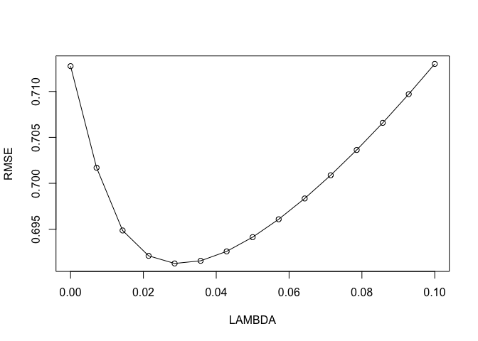

```r
set.seed(99)

trainingData <- solTrainXtrans
trainingData$Solubility <- solTrainY
```


```r
variable.names(solTrainXtrans)
```

```
##   [1] "FP001"             "FP002"             "FP003"            
##   [4] "FP004"             "FP005"             "FP006"            
##   [7] "FP007"             "FP008"             "FP009"            
##  [10] "FP010"             "FP011"             "FP012"            
##  [13] "FP013"             "FP014"             "FP015"            
##  [16] "FP016"             "FP017"             "FP018"            
##  [19] "FP019"             "FP020"             "FP021"            
##  [22] "FP022"             "FP023"             "FP024"            
##  [25] "FP025"             "FP026"             "FP027"            
##  [28] "FP028"             "FP029"             "FP030"            
##  [31] "FP031"             "FP032"             "FP033"            
##  [34] "FP034"             "FP035"             "FP036"            
##  [37] "FP037"             "FP038"             "FP039"            
##  [40] "FP040"             "FP041"             "FP042"            
##  [43] "FP043"             "FP044"             "FP045"            
##  [46] "FP046"             "FP047"             "FP048"            
##  [49] "FP049"             "FP050"             "FP051"            
##  [52] "FP052"             "FP053"             "FP054"            
##  [55] "FP055"             "FP056"             "FP057"            
##  [58] "FP058"             "FP059"             "FP060"            
##  [61] "FP061"             "FP062"             "FP063"            
##  [64] "FP064"             "FP065"             "FP066"            
##  [67] "FP067"             "FP068"             "FP069"            
##  [70] "FP070"             "FP071"             "FP072"            
##  [73] "FP073"             "FP074"             "FP075"            
##  [76] "FP076"             "FP077"             "FP078"            
##  [79] "FP079"             "FP080"             "FP081"            
##  [82] "FP082"             "FP083"             "FP084"            
##  [85] "FP085"             "FP086"             "FP087"            
##  [88] "FP088"             "FP089"             "FP090"            
##  [91] "FP091"             "FP092"             "FP093"            
##  [94] "FP094"             "FP095"             "FP096"            
##  [97] "FP097"             "FP098"             "FP099"            
## [100] "FP100"             "FP101"             "FP102"            
## [103] "FP103"             "FP104"             "FP105"            
## [106] "FP106"             "FP107"             "FP108"            
## [109] "FP109"             "FP110"             "FP111"            
## [112] "FP112"             "FP113"             "FP114"            
## [115] "FP115"             "FP116"             "FP117"            
## [118] "FP118"             "FP119"             "FP120"            
## [121] "FP121"             "FP122"             "FP123"            
## [124] "FP124"             "FP125"             "FP126"            
## [127] "FP127"             "FP128"             "FP129"            
## [130] "FP130"             "FP131"             "FP132"            
## [133] "FP133"             "FP134"             "FP135"            
## [136] "FP136"             "FP137"             "FP138"            
## [139] "FP139"             "FP140"             "FP141"            
## [142] "FP142"             "FP143"             "FP144"            
## [145] "FP145"             "FP146"             "FP147"            
## [148] "FP148"             "FP149"             "FP150"            
## [151] "FP151"             "FP152"             "FP153"            
## [154] "FP154"             "FP155"             "FP156"            
## [157] "FP157"             "FP158"             "FP159"            
## [160] "FP160"             "FP161"             "FP162"            
## [163] "FP163"             "FP164"             "FP165"            
## [166] "FP166"             "FP167"             "FP168"            
## [169] "FP169"             "FP170"             "FP171"            
## [172] "FP172"             "FP173"             "FP174"            
## [175] "FP175"             "FP176"             "FP177"            
## [178] "FP178"             "FP179"             "FP180"            
## [181] "FP181"             "FP182"             "FP183"            
## [184] "FP184"             "FP185"             "FP186"            
## [187] "FP187"             "FP188"             "FP189"            
## [190] "FP190"             "FP191"             "FP192"            
## [193] "FP193"             "FP194"             "FP195"            
## [196] "FP196"             "FP197"             "FP198"            
## [199] "FP199"             "FP200"             "FP201"            
## [202] "FP202"             "FP203"             "FP204"            
## [205] "FP205"             "FP206"             "FP207"            
## [208] "FP208"             "MolWeight"         "NumAtoms"         
## [211] "NumNonHAtoms"      "NumBonds"          "NumNonHBonds"     
## [214] "NumMultBonds"      "NumRotBonds"       "NumDblBonds"      
## [217] "NumAromaticBonds"  "NumHydrogen"       "NumCarbon"        
## [220] "NumNitrogen"       "NumOxygen"         "NumSulfer"        
## [223] "NumChlorine"       "NumHalogen"        "NumRings"         
## [226] "HydrophilicFactor" "SurfaceArea1"      "SurfaceArea2"
```


```r
dim(solTrainXtrans) #951 training observations, 228 predictors
```

```
## [1] 951 228
```


```r
head(solTrainY)
```

```
## [1] -3.97 -3.98 -3.99 -4.00 -4.06 -4.08
```


##PCR


```r
set.seed(99)

#type of resampling method is 10 fold CV
ctrl <- trainControl(method = "cv", number = 10)

pcr_fit <- train(solTrainXtrans, solTrainY,
             method = "pcr",
             tuneLength = 40, #number of principal components
             trControl = ctrl, #resampling method
             preProc = c("center", "scale")) #specify centered and scaled

pcr_fit
```

```
## Principal Component Analysis 
## 
## 951 samples
## 228 predictors
## 
## Pre-processing: centered (228), scaled (228) 
## Resampling: Cross-Validated (10 fold) 
## Summary of sample sizes: 857, 855, 856, 855, 856, 858, ... 
## Resampling results across tuning parameters:
## 
##   ncomp  RMSE       Rsquared    MAE      
##    1     2.0338611  0.01060851  1.5732983
##    2     1.9790301  0.07731656  1.5596251
##    3     1.7098184  0.30639113  1.3500856
##    4     1.6040870  0.38801192  1.2419282
##    5     1.5619531  0.41500385  1.2089559
##    6     1.4415723  0.50041151  1.1165274
##    7     1.2919086  0.60107576  1.0055804
##    8     1.2916564  0.60124320  1.0048972
##    9     1.2931299  0.60025409  1.0072985
##   10     1.2677996  0.61466762  0.9817821
##   11     1.2431157  0.62858301  0.9622633
##   12     1.2424138  0.62900437  0.9615089
##   13     1.2417081  0.62942974  0.9606405
##   14     1.1874379  0.66101654  0.9239673
##   15     1.1544821  0.67954288  0.9064661
##   16     1.1093758  0.70212373  0.8740880
##   17     1.0462943  0.73584463  0.8277657
##   18     1.0424641  0.73743080  0.8224191
##   19     1.0328888  0.74310527  0.8097371
##   20     1.0075921  0.75591388  0.7882558
##   21     1.0004424  0.75959899  0.7814892
##   22     1.0012876  0.75922737  0.7824313
##   23     0.9758035  0.77215014  0.7626874
##   24     0.9785636  0.77044748  0.7676315
##   25     0.9743644  0.77199586  0.7654714
##   26     0.9675965  0.77526789  0.7595519
##   27     0.9619748  0.77773410  0.7541866
##   28     0.9586225  0.77911357  0.7535607
##   29     0.9580359  0.77933406  0.7500548
##   30     0.9546400  0.78092154  0.7460227
##   31     0.9421672  0.78643495  0.7338493
##   32     0.9258797  0.79386930  0.7206782
##   33     0.9172402  0.79856531  0.7154333
##   34     0.9130430  0.80059698  0.7136908
##   35     0.8957929  0.80883544  0.7017192
##   36     0.8886013  0.81244513  0.6944733
##   37     0.8800967  0.81558652  0.6859706
##   38     0.8774227  0.81685315  0.6836977
##   39     0.8728465  0.81858985  0.6807885
##   40     0.8667858  0.82103716  0.6750417
## 
## RMSE was used to select the optimal model using the smallest value.
## The final value used for the model was ncomp = 40.
```

```r
principal_components <- c(1:40)
ggplot(data=pcr_fit, aes(x = pcr_fit$results$RMSE, y = principal_components))
```

<!-- -->

What is the number of PCs that gives the minimum RMSE value and what is the corresponding RMSE value?


```r
min(pcr_fit$results$RMSE)
```

```
## [1] 0.8667858
```

```r
which.min(pcr_fit$results$RMSE)
```

```
## [1] 40
```


**Regression Coefficient Path**


```r
findingCoeffsPerPC_PCR <- pcr(Solubility ~ ., data = trainingData, ncomp = 40, scale=TRUE, validation = "CV")

coeffs <- matrix(findingCoeffsPerPC_PCR$coefficients, nrow = 228, ncol = 40) 

matplot(t(coeffs), type = c("l") ,pch=1,col = 1:40, xlab = "number of components", ylab = "coefficients")
```

<!-- -->


## Ridge Regression


```r
set.seed(99)
ridgeGrid <- data.frame(.lambda = seq(0, .1, length = 15)) #Test different lambda values (0 -> 0.1)
ridge_fit <- train(solTrainXtrans, solTrainY, method = "ridge", tuneGrid = ridgeGrid, trControl = ctrl, preProc = c("center", "scale"))
```


```r
ridge_fit
```

```
## Ridge Regression 
## 
## 951 samples
## 228 predictors
## 
## Pre-processing: centered (228), scaled (228) 
## Resampling: Cross-Validated (10 fold) 
## Summary of sample sizes: 857, 855, 856, 855, 856, 858, ... 
## Resampling results across tuning parameters:
## 
##   lambda       RMSE       Rsquared   MAE      
##   0.000000000  0.7127554  0.8825119  0.5296363
##   0.007142857  0.7016990  0.8857242  0.5281562
##   0.014285714  0.6948668  0.8878309  0.5237983
##   0.021428571  0.6921073  0.8887429  0.5227365
##   0.028571429  0.6912753  0.8891076  0.5231598
##   0.035714286  0.6915641  0.8891707  0.5243785
##   0.042857143  0.6925888  0.8890503  0.5260988
##   0.050000000  0.6941383  0.8888112  0.5278814
##   0.057142857  0.6960860  0.8884926  0.5298581
##   0.064285714  0.6983508  0.8881196  0.5321259
##   0.071428571  0.7008784  0.8877087  0.5345105
##   0.078571429  0.7036309  0.8872717  0.5369546
##   0.085714286  0.7065812  0.8868167  0.5395018
##   0.092857143  0.7097092  0.8863496  0.5422290
##   0.100000000  0.7129996  0.8858747  0.5451619
## 
## RMSE was used to select the optimal model using the smallest value.
## The final value used for the model was lambda = 0.02857143.
```


```r
plot(y = ridge_fit$results$RMSE, x = ridge_fit$results$lambda, type = "o", xlab = 'LAMBDA', ylab='RMSE')
```

<!-- -->

What is the value of lambda that gives the minimum RMSE value?

*lambda = 0.02857143*


```r
ridge_fit$finalModel$tuneValue
```

```
##       lambda
## 5 0.02857143
```

**As expected, the coefficients shrink towards 0 and lambda increases**


```r
x = as.matrix(solTrainXtrans)
glmmod1 <- glmnet(x, y = solTrainY, alpha=0, family="gaussian")
plot(glmmod1, xvar="lambda")
```

<!-- -->


##Lasso


```r
set.seed(99)
enetGrid <- expand.grid(.lambda = c(0), .fraction = seq(.05, 1, length = 20))
lasso_fit <- train(solTrainXtrans, solTrainY, method = "enet",tuneGrid = enetGrid, trControl = ctrl, preProc = c("center", "scale"))
plot(lasso_fit)
```

<!-- -->

```r
which.min(lasso_fit$results[ ,3])
```

```
## [1] 3
```

**Fraction 0.15 gives the smallest RMSE.**

```r
min(lasso_fit$results[ ,3])
```

```
## [1] 0.6787038
```


**As expected, the coefficients go to 0 and lambda increases (some coefficients become = 0)**


```r
x = as.matrix(solTrainXtrans)
glmmod <- glmnet(x, y = solTrainY, alpha=1, family="gaussian")
plot(glmmod, xvar="lambda")
```

<!-- -->


###4.5 Model Selection


```r
n = length(solTestY)

mses = rep(0,3)
names(mses) = c("pcr","ridge","lasso")

y_pcr = predict( pcr_fit$finalModel, solTestXtrans, ncomp = pcr_fit$bestTune[[1]])

y_ridge = predict( ridge_fit$finalModel, solTestXtrans, s = ridge_fit$bestTune[[1]], type ='fit', mode = 'fraction')

y_lasso = predict( lasso_fit$finalModel, solTestXtrans, s = lasso_fit$bestTune[[1]], type ='fit', mode = 'fraction')

mses[1] = (sum(solTestY-y_pcr)^2)* (1/n)
mses[2] =(sum(solTestY - y_ridge$fit)^2)*(1/n)
mses[3] = (sum(solTestY - y_lasso$fit)^2)*(1/n)
sort(mses, decreasing = F)
```

```
##     lasso     ridge       pcr 
##  273.4736 1669.5213 3202.7974
```

```r
plot(mses)
```

<!-- -->
